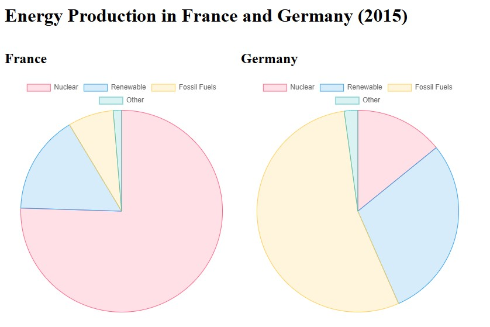

# Energy Production in France and Germany (2015)

This project displays a pie chart visualizing the energy production sources in France and Germany for the year 2015. The data is fetched from Google's Data Commons.

## Visualization

## Data Sources

*   **Data Commons:**
    *   [https://datacommons.org/](https://datacommons.org/)